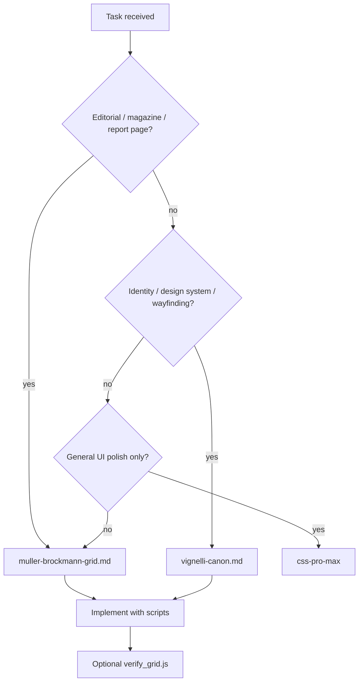

# Web Design

Swiss/International Typographic Style discipline for the web: rigorous grids, baseline rhythm, objective typography, and verifiable alignment. This skill covers **design judgment, aesthetics, and grid engineering**. For CSS implementation details (responsive escalation, spacing tokens, motion, accessibility), defer to the **css-pro-max** skill.

Adapted from the [Hyperagent public skills](https://github.com/alexmcdonnell-airtable/hyperagent-public-skills) Müller-Brockmann and Vignelli Canon skills.

## Scope

| This skill (web-design) | css-pro-max (implementation) |
| --- | --- |
| Style selection (Müller-Brockmann vs Vignelli) | Flex/grid escalation, container queries |
| Modular grid, baseline lock, optical alignment | Spacing scale, gap vs margin |
| Type hierarchy philosophy (two sizes, flush-left) | Typography implementation (fluid type, text-wrap, Japanese) |
| Palette as identifier, anti-patterns | Color tokens, contrast, dark mode |
| Grid overlay toggle, Puppeteer verification | Animation, focus rings, hit targets, z-index |

## Style selection



| Brief signal | Open |
| --- | --- |
| Magazine spread, longform report, editorial landing page, "show the grid" | [muller-brockmann-grid.md](references/muller-brockmann-grid.md) |
| Brand/identity system, style guide, transit diagram, wayfinding, "Vignelli-style" | [vignelli-canon.md](references/vignelli-canon.md) |
| Responsive breakpoints, spacing tokens, motion, a11y audit | **css-pro-max** |
| Font fallback in headless render, image embedding, Puppeteer setup | [production-notes.md](references/production-notes.md) |

**Sibling styles:** Müller-Brockmann = modular magazine grids + verifiable web engineering. Vignelli = six-typeface canon + identity/wayfinding. When both apply (editorial page with strong identity), start with Müller-Brockmann for grid engineering and borrow Vignelli palette/type rules for tokens.

## Common anti-patterns

- **Decorative grid** — overlay is a full-width sibling of a centered container; columns drift at wide viewports. Fix: overlay inside the same content box (see muller-brockmann-grid §2.2).
- **Box-on-grid ≠ ink-on-grid** — large display type looks misaligned because glyph side-bearing offsets the visible ink. Fix: runtime optical alignment (§2.6).
- **"Claude look"** — warm cream background, blue/purple gradients, generic sans hierarchy. Fix: white paper, near-black ink, one accent; hierarchy through scale and white space.
- **Helvetica → Calibri trap** — headless or rasterized output silently falls back to Noto Sans. Fix: [production-notes.md](references/production-notes.md).

## Loading directives

### Grid / layout symptoms

- **MANDATORY — READ** [muller-brockmann-grid.md](references/muller-brockmann-grid.md) when building editorial pages, grid overlays, baseline-locked layouts, or when alignment looks "off" despite correct CSS grid spans.
- **Do NOT load** css-pro-max first for grid overlay misalignment; the bug is usually structural (content box mismatch), not a flex/grid choice.

### Identity / system symptoms

- **MANDATORY — READ** [vignelli-canon.md](references/vignelli-canon.md) when designing identity systems, style guides, transit diagrams, or when the brief asks for timeless Swiss-modernist discipline.
- **Do NOT load** muller-brockmann-grid for pure wayfinding diagram rules; Vignelli transit section is the canonical source.

### Production / verification symptoms

- **MANDATORY — READ** [production-notes.md](references/production-notes.md) when rasterizing SVG/HTML, embedding images in preview iframes, running `verify_grid.js`, or shipping type-critical heroes.
- **Do NOT skip** font-fidelity checks before trusting headless screenshots or canvas optical measurements.

## Delegation to css-pro-max

After applying design discipline from the references above, open css-pro-max for implementation:

| Design decision | css-pro-max reference |
| --- | --- |
| Baseline multiples → spacing implementation | `references/spacing.md` |
| Grid vs flex for component layout | `references/responsive.md` |
| Token naming and CSS custom properties | `references/tokens.md` |
| Font stack, line-height, fluid type, Japanese text | `references/typography.md` |
| Palette scales, text color hierarchy | `references/color.md` |
| Focus, contrast, reduced motion | `references/accessibility.md` |
| Shadows, radii, staggered enters | `references/visual-details.md` |

## Scripts

Run from the skill directory or pass the full path.

### grid_tokens.py — Müller-Brockmann scaffold

```shell
python3 scripts/grid_tokens.py                         # CSS + JS block
python3 scripts/grid_tokens.py --scaffold > index.html # full minimal page
python3 scripts/grid_tokens.py --cols 12 --baseline 8 --gutter 24 --margin 72 --maxw 1296 --accent "#e4002b"
```

Emits `:root` tokens, subgrid `.band` scaffold, overlay CSS, toggle JS, and optical-alignment JS.

### verify_grid.js — grid verification (optional)

Requires `CHROME` (browser binary) and `PUP` (puppeteer-core module path). If unavailable, use manual overlay inspection — see [production-notes.md](references/production-notes.md).

```shell
CHROME=/path/to/chrome PUP=/path/to/node_modules/puppeteer-core node scripts/verify_grid.js --widths=1440,1180,900
```

### vignelli_system.py — Vignelli tokens

```shell
python3 scripts/vignelli_system.py
python3 scripts/vignelli_system.py --primary "#F04E23" --format json
python3 scripts/vignelli_system.py --grid 4x8
python3 scripts/vignelli_system.py --signage
```

## Workflow summary

1. Read the style reference (Müller-Brockmann or Vignelli) based on the brief.
2. Generate scaffold or tokens with the matching script.
3. Build content on the grid: column-line placement, baseline-locked spacing, objective typography.
4. Implement CSS details with css-pro-max where needed.
5. Verify: toggle grid overlay, run `verify_grid.js` if Puppeteer is available, or manual top-left crop inspection.
6. Check [production-notes.md](references/production-notes.md) before rasterizing or embedding assets.

## Future extensions

The Hyperagent repo also includes brand-book, NYT data-viz, and NYC subway campaign skills. They are not bundled here; add as separate references if needed.

## Attribution

Grid engineering and Vignelli Canon content adapted from [alexmcdonnell-airtable/hyperagent-public-skills](https://github.com/alexmcdonnell-airtable/hyperagent-public-skills) (Müller-Brockmann Grid Systems, Vignelli Canon Design System).
